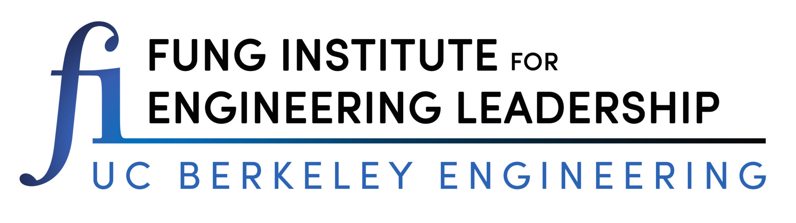
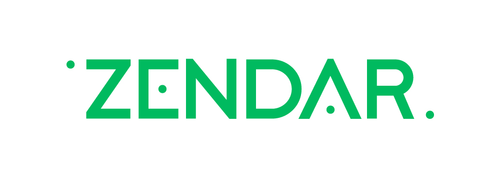

This project improves object detection in autonomous vehicles by integrating radar and camera data. The pipeline processes and aligns data from both sensors, detects objects using YOLO, and clusters radar points with DBSCAN. The merged results offer a precise and reliable view of the vehicle’s surroundings, enhancing detection accuracy and safety in complex environments.

    
    
    

## Demo
   

   
   Driving scene showing obstacles detected by our pipeline
   
   Raw data from radar and camera sensors


## Motivation



1. **Data Fusion Validation:**  
   Labeling objects detected in both radar point clouds and images ensures accurate and consistent data fusion, improving reliability for tasks like object tracking and decision-making.

2. **Enhanced Object Understanding:**  
   Combining radar data with image detections provides a richer view of object properties, such as position, velocity, and appearance, aiding in classification and behavior prediction.

3. **Improved Detection Performance:**  
   Fusing radar and camera data enhances object detection accuracy, reducing false positives and negatives, and confirming object presence in the scene.

4. **Increased Safety and Reliability:**  
   In autonomous driving and ADAS, labeling objects detected by both radar and camera adds redundancy, boosting system safety and reliability.

## Overview

We process the images and radar point clouds separately before merging the outputs to create a robust prediction of the objects surrounding the vehicle. The pipeline consists of the following steps:



## Coordinate Transformation

Coordinate transformation involves converting radar data from its native coordinate system (radar space) to a coordinate system that is aligned with the camera data (camera space). This process allows for the integration of information from multiple sensors to improve the accuracy of object detection and localization in complex environments.




## YOLO Object Detection

YOLO (You Only Look Once) is a real-time object detection algorithm. It leverages a single neural network to simultaneously predict object classes and bounding boxes for those objects in input images. The algorithm is trained using a large dataset of labeled images and backpropagation to update the weights of the neural network



## Radar point cloud clustering

DBSCAN (Density-Based Spatial Clustering of Applications with Noise) is an unsupervised clustering algorithm that identifies clusters by grouping data points that are closely packed together in feature space. It separates distant points as noise, effectively handling clusters of varying shapes and densities. The algorithm expands clusters by iteratively adding nearby points that meet the defined distance (epsilon) and minimum points criteria, continuing until no further points can be included.



## Merging Radar Clusters with Image Labels

The final step of the pipeline is to combine the results generated by the clustering and labeling algorithm. Radar point data clusters obtained from the DBSCAN algorithm are merged with object labels generated by the YOLO algorithm for the image data. This combination is accomplished by utilizing the overlapping bounding boxes between the radar points and image labels as a means of matching the results.




## Final bird's eye view and limitations

Displaying the final results in a bird's eye view provides a comprehensive overview of the detected objects in the scene. The combined radar and image labels are visualized in a top-down perspective, allowing for easy interpretation of the object positions and orientations.



## Strengths and Opportunities for Improvement in Our End-to-End Pipeline

Our end-to-end pipeline has demonstrated strong results in object detection and localization. To further enhance its performance, we have identified a few areas with potential for improvement:

1. **Sensor Quality:**  
   The accuracy of our system benefits greatly from high-quality input data from radar and image sensors. By using advanced sensors and improving data quality, we can further boost the pipeline's performance.

2. **Algorithm Enhancement:**  
   While the YOLO object detection and DBSCAN clustering algorithms perform well, there is room for refinement. Enhancing YOLO to better detect small or partially hidden objects and fine-tuning DBSCAN's hyperparameters can lead to even more precise results.

3. **Optimized Computational Efficiency:**  
   Our pipeline is designed for real-time processing, which requires substantial computational power. By optimizing the system for efficiency, we can ensure smooth performance even on lower-end hardware and with large datasets.

4. **Broader Generalization:**  
   We are committed to ensuring that our pipeline excels in diverse and complex environments. Continued testing and validation will help us further improve the system's robustness in various real-world scenarios.

  
 Credits:  
This project was conducted in collaboration with [ZENDAR](https://www.zendar.io/) by Hendrik Chiche, Du Xiang, Constantin El Ghazi, and Cheng-Kai Chen.