
---

Author: Hendrik Chiche

Supervisor: Eric Chevalier

## Background and Motivation

Every airborne vehicle is subject to continuous friction with atmospheric particles and air molecules, leading to triboelectric charge separation and accumulation on the fuselage. This effect can be modeled analogously to a capacitor:

$$
V = \frac{Q}{C}
$$

where:
- \( V \) is the potential difference generated,
- \( Q \) is the accumulated charge,
- \( C \) is the effective capacitance of the airframe.

Measurements have shown potentials up to **400 kV** and stored electrostatic energies between **20 – 30 J**, which can lead to:

- Dangerous electric discharges during rescue operations  
- Ignition of flammable vapors  
- Severe radio interference from corona discharges

   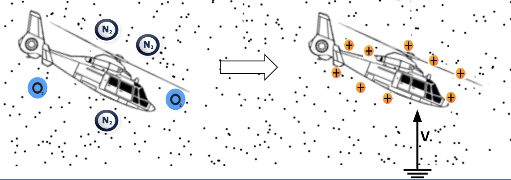
   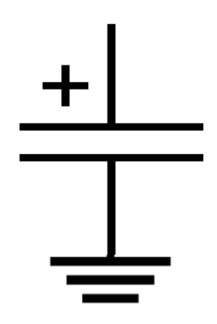

The triboelectric charging of an aircraft can be described by the following fundamental relations:

- The first equation  
$$
dV = \frac{I_{tribo}}{C(z)} \, dt
$$  
expresses how the potential \(V\) increases over time as a result of the **triboelectric charging current** \(I_{tribo}\). The rate of voltage rise depends inversely on the aircraft’s effective capacitance \(C(z)\).

- The second equation  
$$
C(z) = \frac{2 S \varepsilon_{air}}{z}
$$  
shows that this capacitance depends on the **altitude** \(z\): it is proportional to the surface area \(S\) of the aircraft and the permittivity of air \(\varepsilon_{air}\), and inversely proportional to the distance from the conducting ground plane. As altitude increases, \(C(z)\) decreases, meaning that a given charging current will generate a higher potential.

### Limitations of Passive Systems

Conventional passive discharge devices rely on ionization at sharp points. On fast-moving airplanes (≈ 200 m/s), these devices are effective because charged particles are swept away by the airflow.  
However, helicopters operate at much lower relative airspeeds (≈ 60 m/s), causing ions to **recombine with the surface**. As a result, passive devices fail to sufficiently neutralize surface charge.

---

## Research Objective

> **How can we design and optimize an active electrostatic discharger capable of operating efficiently under helicopter flight conditions?**

Our approach focuses on using **forced airflow and controlled ionization** to actively repel charged particles from the aircraft body.

---

## Methodology

### Principle of the active discharger

In the presence of a strong electric field between a high‑voltage positive probe and a grounded surface, ambient water vapor is ionized, producing positive ions (predominantly hydrated protons). A simplified reaction is:

$$\mathrm{H_2O} \;\xrightarrow{E}\; \mathrm{H^+} + \mathrm{OH^-}$$

These ions drift with the electric field but can also be actively entrained with a nozzle jet, which sweeps them away from the surface effectively neutralizing the charge of the system.

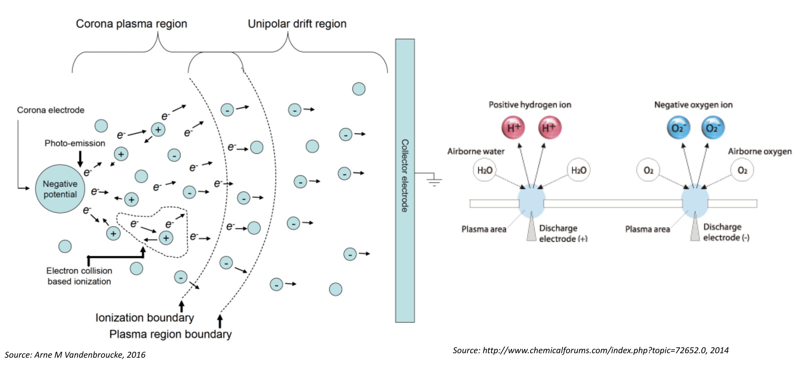

### Concept and Design

We propose a discharge device consisting of:
- A **conductive probe** connected to a high-voltage source (10kV DC)
- A **funnel-shaped nozzle (tuyère)** to accelerate airflow  
- A carefully defined **ionization region** to promote charge neutralization

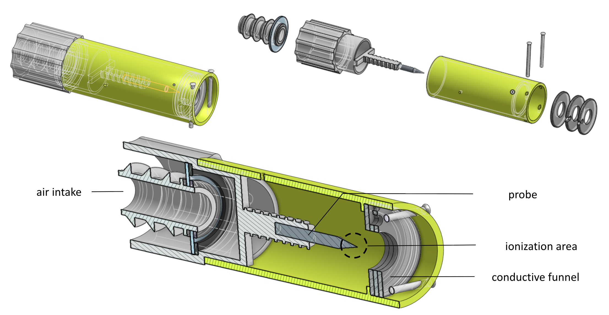

---

### Numerical Simulation

To understand the influence of key design parameters, CFD simulations were conducted using **SimScale**. The following variables were investigated:

- **Funnel geometry** – influences flow acceleration and ionization stability  
- **Probe position** – controls local electric field distribution  
- **Airflow velocity** – determines charged particle transport efficiency  

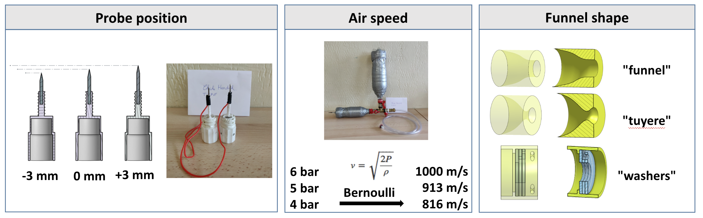

Simulation results showed, the maximum air speed at the probe tip was found by moving the probe 3mm into the bottleneck of the funnel. Using the input pressure of 6 bar the air velocity at the probe tip was about 1200 to 1500 m/s.

- Optimal probe offset ≈ –3 mm  
- Maximum airspeed at the probe tip ≈ 1200 – 1500 m/s  
- Maximum air speed with a **“tuyère”** funnel geometry

   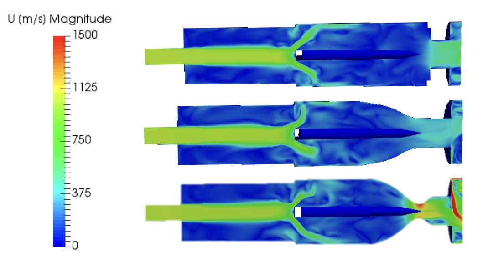
   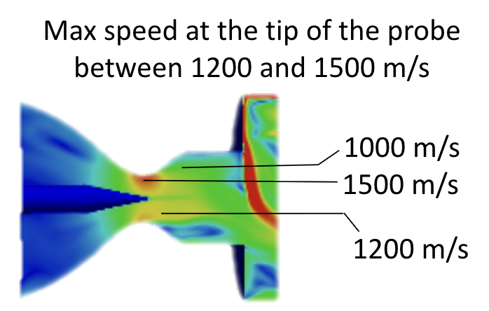

---

### Experimental Setup

A dedicated **test bench** was built to measure the discharge current generated by the device with the previous design parameters from the simulations. Key components include:

- **HV generator** – Wimshurst machine generating about 10kV DC
- **Pressurized air system** – Air tank with a 1/4 turn valve to quickly release the pressure
- **Measurement probes** – Aquistion system to measure the discharge current at the probe tip with micro second resolution.

To control the intake speed, we supplied air from a tank at three set pressures (6, 5, and 4 bar). Applying Bernoulli's relation \( v = \sqrt{2P/\rho} \) at the nozzle intake, these correspond to approximate velocities of 1000 m/s, 913 m/s, and 816 m/s, respectively.

Experiments tested the effects of probe distance, airflow velocity, and nozzle shape on discharge behavior.

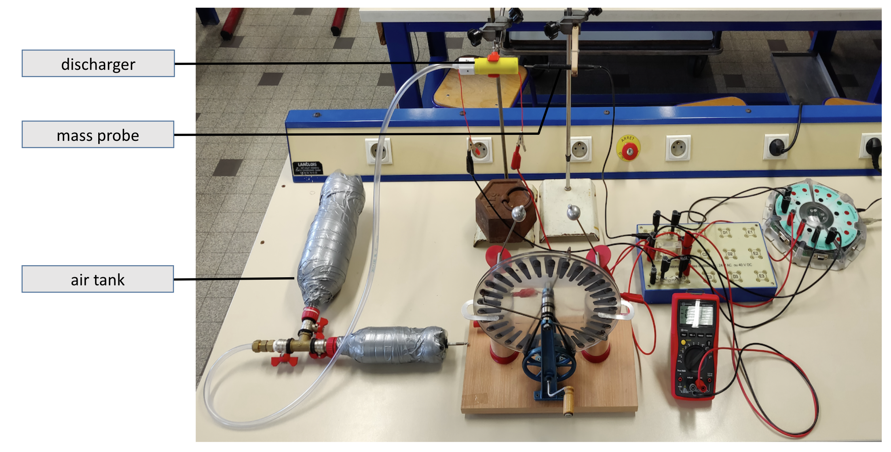
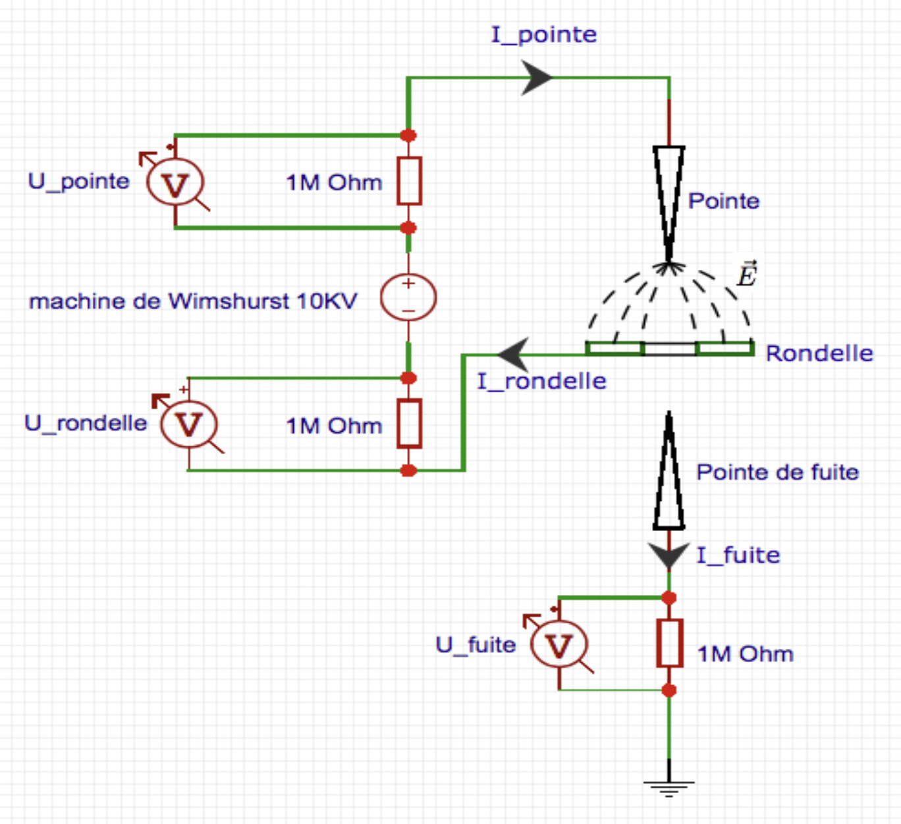
---

## Results

### Probe Distance Effects

Experiments revealed that excessively small probe-to-funnel distances result in **arc discharges** instead of corona, due to excessive electric field strength:

$$
E = \frac{V}{d}
$$

It was found that despite the many arc discharges with a period of 250 micro seconds, the device can generate a mean discharge current up to 4.9 micro ampere.

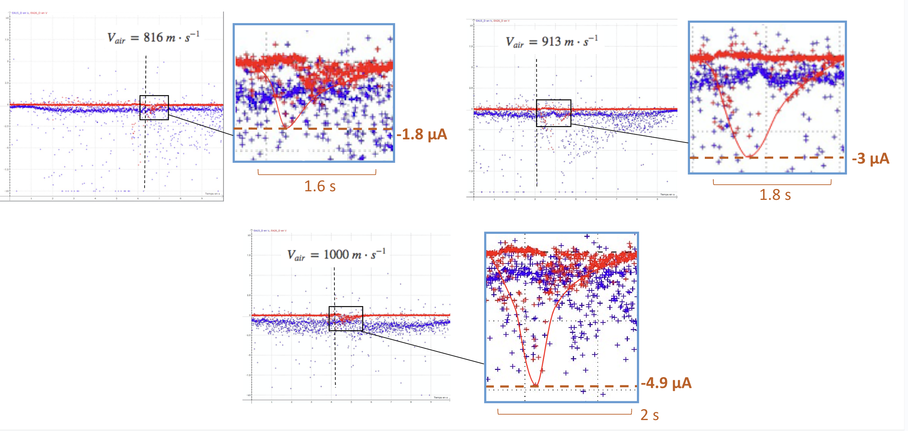

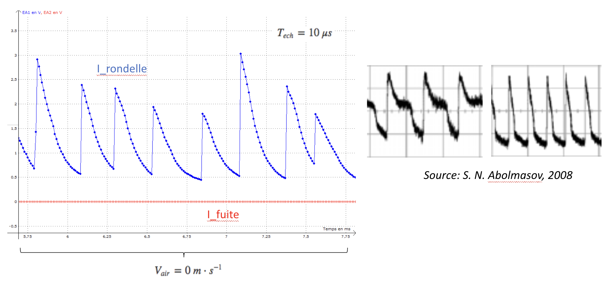

### Airflow Velocity Effects

Increasing airflow velocity significantly enhanced particle removal, confirming the need for forced convection to counteract ion recombination in slow-moving rotorcraft environments.

| Pressure (bar) | Maximum Discharge Current (μA) |
|----------------|-------------------------------|
| 4              | 1.8                          |
| 5              | 3.0                          |
| 6              | 4.9                          |

---

## Discussion

The combination of simulation and experimental data demonstrates that **active discharge devices** can overcome the limitations of passive systems on helicopters. The accelerated air flow ensures that charged particles are expelled, while the optimized probe geometry maximizes **ion generation efficiency**.

The optimized configuration achieved:

- Rapid arc discharge under operational conditions  
- An output current of up to 4.9 micro ampere

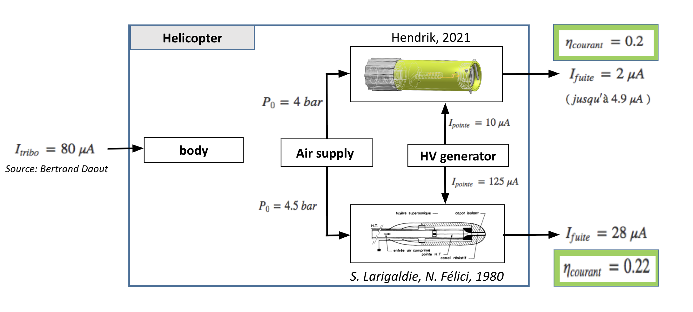

---

## Applications and Future Work

Future investigations could explore the relationship between probe voltage and discharge current. Testing different voltage levels would provide valuable insights potentially enabling optimization of the discharge system.

The proposed system offers immediate safety benefits for rotary-wing aircraft during:

- Rescue and winching operations  
- Military and firefighting missions  
- Offshore platform transport

Future research could explore application to UAVs and hybrid VTOL aircraft.

---

## References

- S. Larigaldie & N. Félici, *Etude expérimentale d’un déchargeur électrostatique pour hélicoptère*, 1980  
- S. N. Abolmasov, *Electrostatic Discharge Studies*, 2008  
- Bertrand Daout, *Les essais ESD sur les hélicoptères et les avions*  
- Willow Grove, *Helicopter Static Electricity Discharging Device* 

